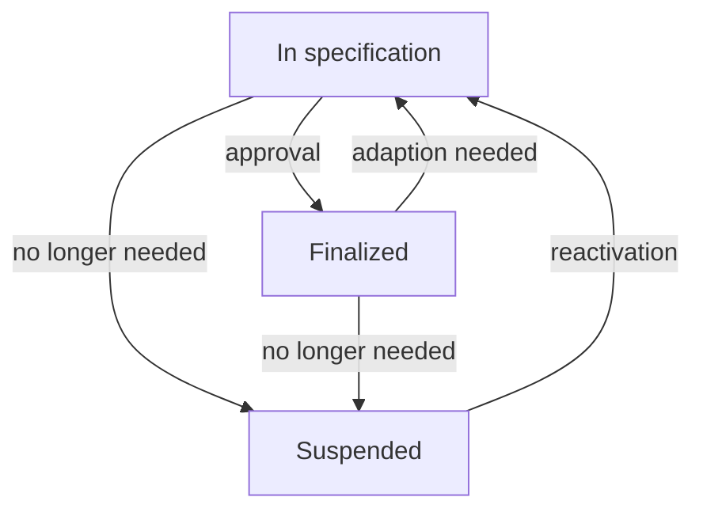

**ID**: REQ_0003

**Status**: In specification

**Type**: Non-Functional

**Description**: 
Requirements shall have one of the following states:
- In specification
- Finalized
- Suspended

```mermaid
flowchart TD;
    InSpec["In specification"] -- approval --> Finalized
    InSpec -- no longer needed --> Suspended

    Finalized -- adaption needed --> InSpec
    Finalized -- no longer needed --> Suspended

    Suspended -- reactivation --> InSpec
```