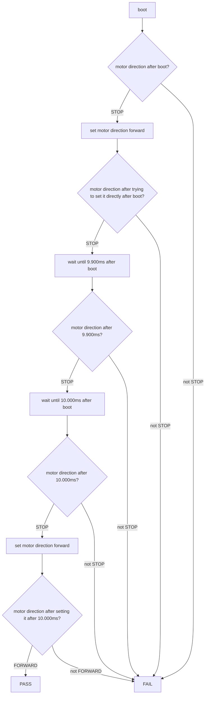

**REQ**: REQ_0001

```mermaid
flowchart TD
    START[boot] --> V0{motor direction after boot?}
    V0 -- STOP --> A1[set motor direction forward]
    A1 --> V1{motor direction after trying to set it directly after boot?}
    V1 -- STOP --> A2[wait until 9.900ms after boot]
    A2 --> V2{motor direction after 9.900ms?}
    V2 -- STOP --> A3[wait until 10.000ms after boot]
    A3 --> V3{motor direction after 10.000ms?}
    V3 -- STOP --> A4[set motor direction forward]
    A4 --> V4{motor direction after setting it after 10.000ms?}
    V4 -- FORWARD --> PASS

    V0 -- not STOP --> FAIL
    V1 -- not STOP --> FAIL
    V2 -- not STOP --> FAIL
    V3 -- not STOP --> FAIL
    V4 -- not FORWARD --> FAIL
```
    