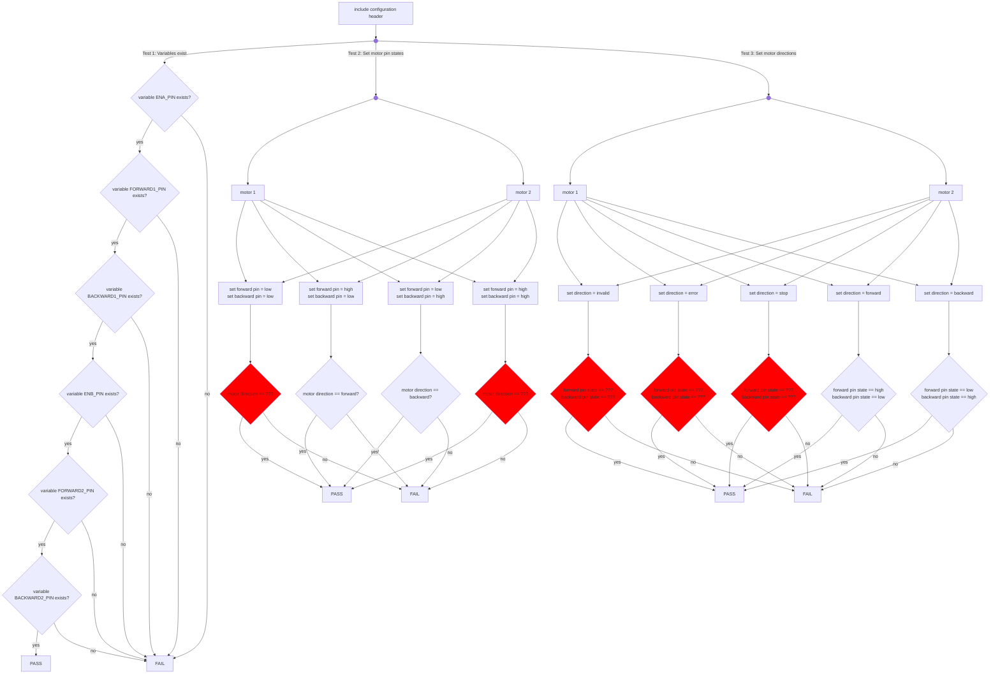

**REQ**: REQ_0002

```mermaid
flowchart TD
    START[include configuration header] --> J1@{shape: junction}
    J1 -- Test 1: Variables exist --> V1_1{variable ENA_PIN exists?}
    V1_1 -- yes --> V1_2{variable FORWARD1_PIN exists?}
    V1_2 -- yes --> V1_3{variable BACKWARD1_PIN exists?}
    V1_3 -- yes --> V1_4{variable ENB_PIN exists?}
    V1_4 -- yes --> V1_5{variable FORWARD2_PIN exists?}
    V1_5 -- yes --> V1_6{variable BACKWARD2_PIN exists?}
    V1_6 -- yes --> P1_1["PASS"]

    V1_1 -- no --> F1_1["FAIL"]
    V1_2 -- no --> F1_1["FAIL"]
    V1_3 -- no --> F1_1["FAIL"]
    V1_4 -- no --> F1_1["FAIL"]
    V1_5 -- no --> F1_1["FAIL"]
    V1_6 -- no --> F1_1["FAIL"]

    J1 -- Test 2: Set motor pin states --> J2_1@{shape: junction}
    J2_1 --> B2_1["motor 1"]
    B2_1 --> A2_1["set forward pin = low<br>set backward pin = low"]
    B2_1 --> A2_2["set forward pin = high<br>set backward pin = low"]
    B2_1 --> A2_3["set forward pin = low<br>set backward pin = high"]
    B2_1 --> A2_4["set forward pin = high<br>set backward pin = high"]
    A2_1 --> V2_1{"motor direction == ???"}
    style V2_1 fill:#f00
    A2_2 --> V2_2{"motor direction == forward?"}
    A2_3 --> V2_3{"motor direction == backward?"}
    A2_4 --> V2_4{"motor direction == ???"}
    style V2_4 fill:#f00
    
    V2_1 -- yes --> P2_1["PASS"]
    V2_1 -- no --> F2_1["FAIL"]
    V2_2 -- yes --> P2_1["PASS"]
    V2_2 -- no --> F2_1["FAIL"]
    V2_3 -- yes --> P2_1["PASS"]
    V2_3 -- no --> F2_1["FAIL"]
    V2_4 -- yes --> P2_1["PASS"]
    V2_4 -- no --> F2_1["FAIL"]

    J2_1 --> B2_2["motor 2"]
    B2_2 --> A2_1
    B2_2 --> A2_2
    B2_2 --> A2_3
    B2_2 --> A2_4

    J1 -- Test 3: Set motor directions --> J3_1@{shape: junction}
    J3_1 --> B3_1["motor 1"]
    B3_1 --> A3_1["set direction = invalid"]
    B3_1 --> A3_2["set direction = error"]
    B3_1 --> A3_3["set direction = stop"]
    B3_1 --> A3_4["set direction = forward"]
    B3_1 --> A3_5["set direction = backward"]
    A3_1 --> V3_1{forward pin state == ???<br>backward pin state == ???}
    style V3_1 fill:#f00
    A3_2 --> V3_2{forward pin state == ???<br>backward pin state == ???}
    style V3_2 fill:#f00
    A3_3 --> V3_3{forward pin state == ???<br>backward pin state == ???}
    style V3_3 fill:#f00
    A3_4 --> V3_4{forward pin state == high<br>backward pin state == low}
    A3_5 --> V3_5{forward pin state == low<br>backward pin state == high}

    V3_1 -- yes --> P3_1["PASS"]
    V3_1 -- no --> F3_1["FAIL"]
    V3_2 -- yes --> P3_1["PASS"]
    V3_2 -- no --> F3_1["FAIL"]
    V3_3 -- yes --> P3_1["PASS"]
    V3_3 -- no --> F3_1["FAIL"]
    V3_4 -- yes --> P3_1["PASS"]
    V3_4 -- no --> F3_1["FAIL"]
    V3_5 -- yes --> P3_1["PASS"]
    V3_5 -- no --> F3_1["FAIL"]

    J3_1 --> B3_2["motor 2"]
    B3_2 --> A3_1
    B3_2 --> A3_2
    B3_2 --> A3_3
    B3_2 --> A3_4
    B3_2 --> A3_5
```
    