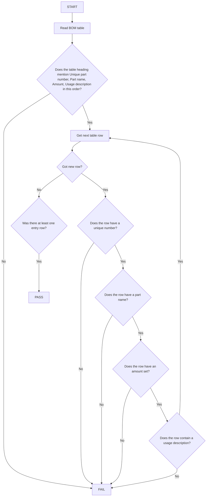

**REQ**: REQ_0005

```mermaid
graph TD;
    START --> A0[Read BOM table]
    A0 --> V0{Does the table heading mention Unique part number, Part name, Amount, Usage description in this order?}
    V0 -- Yes --> A1[Get next table row]
    A1 --> V1{Got new row?}
    V1 -- Yes --> V2{Does the row have a unique number?}
    V2 -- Yes --> V3{Does the row have a part name?}
    V3 -- Yes --> V4{Does the row have an amount set?}
    V4 -- Yes --> V5{Does the row contain a usage description?}
    V5 -- Yes --> A1

    V1 -- No --> V6{Was there at least one entry row?}
    V6 -- Yes --> PASS
    
    V0 -- No --> FAIL
    V2 -- No --> FAIL
    V3 -- No --> FAIL
    V4 -- No --> FAIL
    V5 -- No --> FAIL
```
    