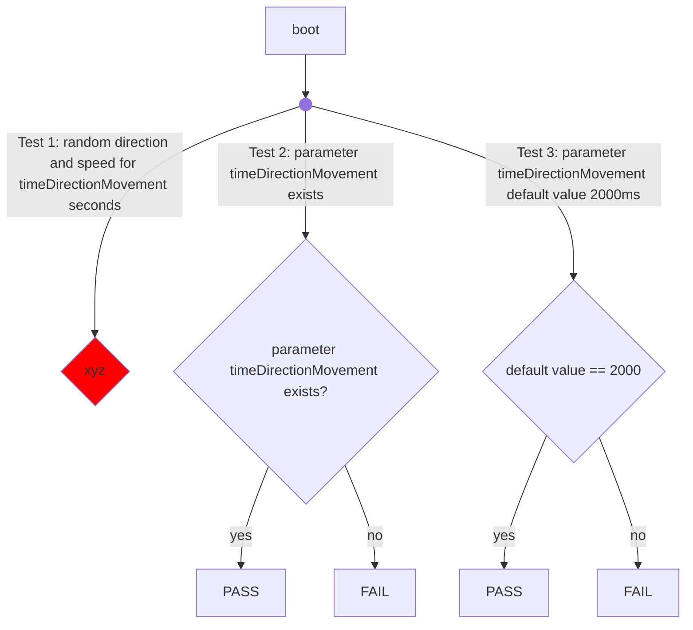

**REQ**: REQ_0007

todo: finalize

```mermaid
flowchart TD
    START[boot] --> J1@{shape: junction}
    J1 -- Test 1: random direction and speed for timeDirectionMovement seconds --> V1_1{xyz}
    style V1_1 fill:#F00
    
    J1 -- Test 2: parameter timeDirectionMovement exists --> V2_1{parameter timeDirectionMovement exists?}
    V2_1 -- yes --> PASS2_1["PASS"]
    V2_1 -- no --> FAIL2_1["FAIL"]

    J1 -- Test 3: parameter timeDirectionMovement default value 2000ms --> V3_1{default value == 2000}
    V3_1 -- yes --> PASS3_1["PASS"]
    V3_1 -- no --> FAIL3_1["FAIL"]
```