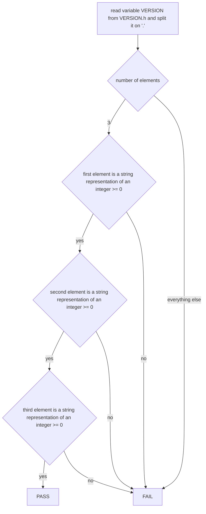

**REQ**: REQ_0011

```mermaid
flowchart TD
    A1_1["read variable VERSION from VERSION.h and split it on '.'"] --> V1_1{"number of elements"}
    V1_1 -- 3 --> V1_2{"first element is a string representation of an integer >= 0"}
    V1_2 -- yes --> V1_3{"second element is a string representation of an integer >= 0"}
    V1_3 -- yes --> V1_4{"third element is a string representation of an integer >= 0"}
    V1_4 -- yes --> PASS1_1["PASS"]

    V1_1 -- everything else --> FAIL1_1["FAIL"]
    V1_2 -- no --> FAIL1_1["FAIL"]
    V1_3 -- no --> FAIL1_1["FAIL"]
    V1_4 -- no --> FAIL1_1["FAIL"]
```