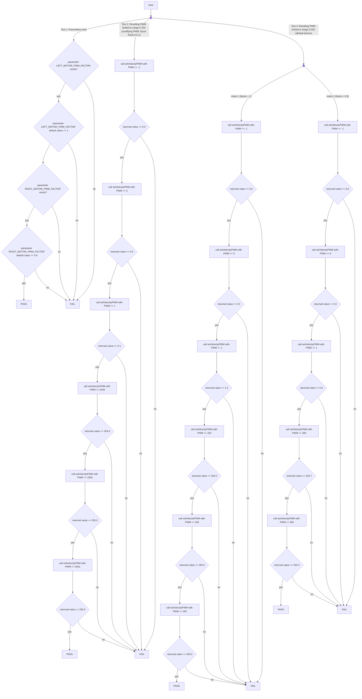

**REQ**: REQ_0015

```mermaid
flowchart TD
    START[boot] --> J1@{shape: junction}
    J1 -- Test 1: Parameters exist --> V1_1{parameter LEFT_MOTOR_PWM_FACTOR exists?}
    V1_1 -- yes --> V1_2{parameter LEFT_MOTOR_PWM_FACTOR default value == 1}
    V1_2 --> V1_3{parameter RIGHT_MOTOR_PWM_FACTOR exists?}
    V1_3 -- yes --> V1_4{parameter RIGHT_MOTOR_PWM_FACTOR default value == 0.9}
    V1_4 -- yes --> PASS1_1["PASS"]

    V1_1 -- no --> FAIL1_1["FAIL"]
    V1_2 -- no --> FAIL1_1["FAIL"]
    V1_3 -- no --> FAIL1_1["FAIL"]
    V1_4 -- no --> FAIL1_1["FAIL"]

    J1 -- Test 2: Resulting PWM limited to range 0-255 (modifying PWM, factor fixed to 0.1) --> A2_1["call setVelocityPWM with PWM == -1"]
    A2_1 --> V2_1{"returned value == 0.0"}
    V2_1 -- yes --> A2_2["call setVelocityPWM with PWM == 0"]
    A2_2 --> V2_2{"returned value == 0.0"}
    V2_2 -- yes --> A2_3["call setVelocityPWM with PWM == 1"]
    A2_3 --> V2_3{"returned value == 0.1"}
    V2_3 -- yes --> A2_4["call setVelocityPWM with PWM == 2549"]
    A2_4 --> V2_4{"returned value == 254.9"}
    V2_4 -- yes --> A2_5["call setVelocityPWM with PWM == 2550"]
    A2_5 --> V2_5{"returned value == 255.0"}
    V2_5 -- yes --> A2_6["call setVelocityPWM with PWM == 2551"]
    A2_6 --> V2_6{"returned value == 255.0"}
    V2_6 -- yes --> PASS2_1["PASS"]

    V2_1 -- no --> FAIL2_1["FAIL"]
    V2_2 -- no --> FAIL2_1["FAIL"]
    V2_3 -- no --> FAIL2_1["FAIL"]
    V2_4 -- no --> FAIL2_1["FAIL"]
    V2_5 -- no --> FAIL2_1["FAIL"]
    V2_6 -- no --> FAIL2_1["FAIL"]

    J1 -- Test 3: Resulting PWM limited to range 0-255 (default factors) --> J2@{shape: junction}
    J2 -- motor 1 (factor = 1) --> A3_1["call setVelocityPWM with PWM == -1"]
    A3_1 --> V3_1{"returned value == 0.0"}
    V3_1 -- yes --> A3_2["call setVelocityPWM with PWM == 0"]
    A3_2 --> V3_2{"returned value == 0.0"}
    V3_2 -- yes --> A3_3["call setVelocityPWM with PWM == 1"]
    A3_3 --> V3_3{"returned value == 1.0"}
    V3_3 -- yes --> A3_4["call setVelocityPWM with PWM == 254"]
    A3_4 --> V3_4{"returned value == 254.0"}
    V3_4 -- yes --> A3_5["call setVelocityPWM with PWM == 255"]
    A3_5 --> V3_5{"returned value == 255.0"}
    V3_5 -- yes --> A3_6["call setVelocityPWM with PWM == 256"]
    A3_6 --> V3_6{"returned value == 255.0"}
    V3_6 -- yes --> PASS3_1["PASS"]

    V3_1 -- no --> FAIL3_1["FAIL"]
    V3_2 -- no --> FAIL3_1["FAIL"]
    V3_3 -- no --> FAIL3_1["FAIL"]
    V3_4 -- no --> FAIL3_1["FAIL"]
    V3_5 -- no --> FAIL3_1["FAIL"]
    V3_6 -- no --> FAIL3_1["FAIL"]

    J2 -- motor 2 (factor = 0.9) --> A4_1["call setVelocityPWM with PWM == -1"]
    A4_1 --> V4_1{"returned value == 0.0"}
    V4_1 -- yes --> A4_2["call setVelocityPWM with PWM == 0"]
    A4_2 --> V4_2{"returned value == 0.0"}
    V4_2 -- yes --> A4_3["call setVelocityPWM with PWM == 1"]
    A4_3 --> V4_3{"returned value == 0.9"}
    V4_3 -- yes --> A4_4["call setVelocityPWM with PWM == 283"]
    A4_4 --> V4_4{"returned value == 254.7"}
    V4_4 -- yes --> A4_5["call setVelocityPWM with PWM == 284"]
    A4_5 --> V4_5{"returned value == 255.0"}
    V4_5 -- yes --> PASS4_1["PASS"]

    V4_1 -- no --> FAIL4_1["FAIL"]
    V4_2 -- no --> FAIL4_1["FAIL"]
    V4_3 -- no --> FAIL4_1["FAIL"]
    V4_4 -- no --> FAIL4_1["FAIL"]
    V4_5 -- no --> FAIL4_1["FAIL"]
```