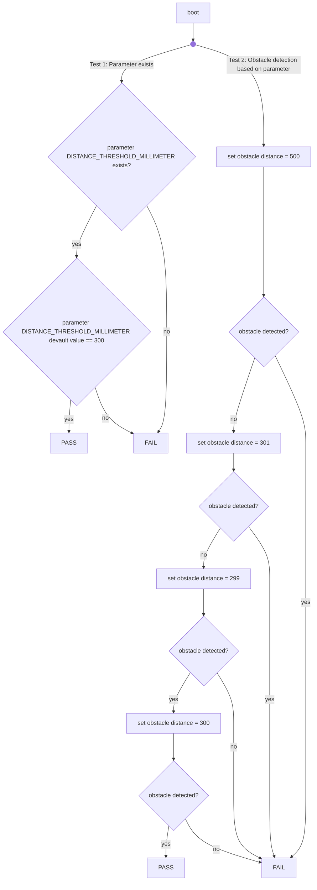

**REQ**: REQ_0019

```mermaid
flowchart TD
    START[boot] --> J1@{shape: junction}
    J1 -- Test 1: Parameter exists --> V1_1{parameter DISTANCE_THRESHOLD_MILLIMETER exists?}
    V1_1 -- yes --> V1_2{parameter DISTANCE_THRESHOLD_MILLIMETER devault value == 300}
    V1_2 -- yes --> PASS1_1["PASS"]

    V1_1 -- no --> FAIL1_1["FAIL"]
    V1_2 -- no --> FAIL1_1["FAIL"]

    J1 -- Test 2: Obstacle detection based on parameter --> A2_1["set obstacle distance = 500"]
    A2_1 --> V2_1{"obstacle detected?"}
    V2_1 -- no --> A2_2["set obstacle distance = 301"]
    A2_2 --> V2_2{"obstacle detected?"}
    V2_2 -- no --> A2_3["set obstacle distance = 299"]
    A2_3 --> V2_3{"obstacle detected?"}
    V2_3 -- yes --> A2_4["set obstacle distance = 300"]
    A2_4 --> V2_4{"obstacle detected?"}
    V2_4 -- yes --> PASS2_1["PASS"]

    V2_1 -- yes --> FAIL2_1["FAIL"]
    V2_2 -- yes --> FAIL2_1["FAIL"]
    V2_3 -- no --> FAIL2_1["FAIL"]
    V2_4 -- no --> FAIL2_1["FAIL"]
```